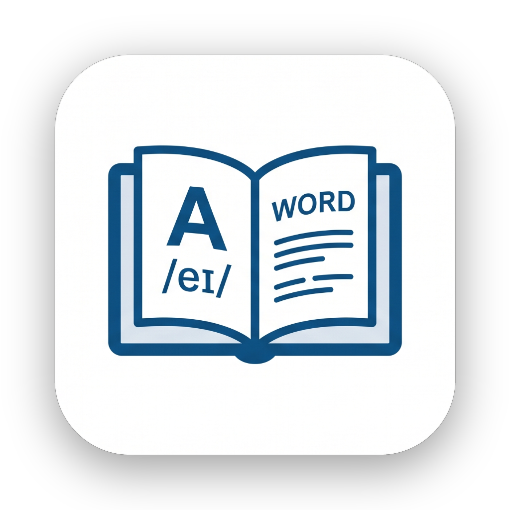

<p align="center">
  
</p>

# English Hugging Me

**悬浮背词** — 一款跨平台桌面/移动端英语词汇悬浮窗应用，让你在使用电脑或手机的同时，随时随地沉浸式背单词。

词汇来源：[english-vocabulary](https://github.com/KyleBing/english-vocabulary)

## 功能特性

- **悬浮窗显示**：半透明圆角悬浮窗常驻屏幕最上层，不影响正常操作
- **定时轮播**：按照设定间隔自动切换显示下一个单词（默认 8 秒）
- **多种播放顺序**：支持顺序播放、完全随机和随机不重复
- **多种显示模式**：
  - 只显示单词
  - 单词 + 释义
  - 单词 + 释义 + 常用短语
- **两种悬浮行为**：
  - 可拖动 — 自由拖放悬浮窗位置
  - 点击穿透 — 鼠标/触摸完全穿透悬浮窗（Windows 通过 JNA 实现）
- **挖空复习**：随机隐藏单词字母并逐步恢复，可控制短语和释义显示
- **学习记录**：分别保存各词库在不同播放模式下的学习进度
- **自定义词库**：可在桌面端和 Android 端添加、编辑与删除自己的词汇
- **可定制**：透明度、颜色（单词 / 词性 / 释义 / 短语各自独立）、字号等可调节
- **跨平台**：同时支持 Windows 桌面端和 Android 移动端

## 项目结构

```
english-hugging-me/
├── core/                              # 核心模块（Java Library）
│   └── me.englishhugging.core
│       ├── model/                     # 数据模型
│       │   ├── WordEntry              #   单词条目（单词 + 释义 + 短语）
│       │   ├── Translation            #   释义模型（词性 + 中文释义）
│       │   ├── Phrase                 #   短语模型（短语 + 中文释义）
│       │   └── WordDisplaySegment     #   格式化显示片段
│       ├── vocabulary/                # 词库管理
│       │   ├── VocabularyCatalog      #   内置词库目录
│       │   └── VocabularyJsonLoader   #   JSON 词库加载器（Gson）
│       ├── settings/                  # 应用配置
│       │   ├── AppSettings            #   全局设置（词库、显示模式、颜色等）
│       │   ├── SettingsKeys           #   配置键名常量
│       │   ├── SettingsMapper         #   配置项读写映射
│       │   ├── SettingsStorage        #   存储引擎接口
│       │   ├── DisplayMode            #   显示模式枚举
│       │   ├── PlaybackMode           #   播放模式枚举
│       │   └── OverlayMode            #   悬浮行为枚举
│       ├── display/                   # 显示处理
│       │   ├── FillBlankGenerator     #   填空考核算法
│       │   └── WordDisplayFormatter   #   单词 → 显示片段的格式化器
│       ├── WordSchedulerConfig        # 定时轮播配置参数
│       └── WordScheduler              # 定时轮播调度多线程引擎
│
├── desktop/                           # 桌面端模块（JavaFX + AtlantaFX）
│   └── me.englishhugging.desktop
│       ├── overlay/                   # 悬浮窗
│       │   ├── DesktopOverlayController  # 悬浮窗生命周期、拖动、缩放、渲染
│       │   ├── ScreenStateMonitor        # 锁屏时暂停、解锁后恢复播放
│       │   └── WindowsClickThrough       # Windows 点击穿透（JNA + Win32 API）
│       ├── settings/                  # FXML 设置页面控制器
│       │   ├── DesktopSettingsPanel   #   设置窗口主框架（Tab 组装）
│       │   ├── GeneralSettingsTab     #   常规设置 Tab
│       │   ├── VocabularySettingsTab  #   词库设置 Tab
│       │   ├── CustomVocabularyTab    #   自定义词汇 Tab
│       │   ├── AppearanceSettingsTab  #   外观设置 Tab（颜色、字号）
│       │   ├── PlaybackRecordsTab     #   播放记录 Tab
│       │   └── DesktopSettingsStore   #   桌面端设置持久化（Properties 文件）
│       ├── ui/                        # 通用 UI
│       │   ├── DesktopUi              #   FXML 与 CSS 资源加载
│       │   └── DesktopTrayController  #   系统托盘图标与菜单
│       ├── resources/                 # 桌面端声明式界面资源
│       │   ├── fxml/                  #   设置窗口及五个设置页面
│       │   └── styles/desktop.css     #   AtlantaFX 布局补充样式
│       ├── FloatingWordsDesktopApp    # 应用入口与协调器
│       ├── DesktopLauncher            # main 方法启动器
│       └── DesktopVocabularyLoader    # 词库文件加载
│
├── android/                           # Android 端模块
│   └── me.englishhugging.android
│       ├── overlay/                   # 悬浮窗服务
│       │   └── OverlayService         #   悬浮窗前台服务 + 单词渲染
│       ├── settings/                  # 设置持久化
│       │   └── AndroidSettingsStore   #   Android 设置（SharedPreferences）
│       ├── ui/                        # UI 行为与页面控制器
│       │   ├── tabs/                  #   XML + View Binding 页面控制器
│       │   │   ├── HomeTab            #     首页仪表盘
│       │   │   ├── SettingsTab        #     全局设置页
│       │   │   ├── RecordsTab         #     历史进度记录
│       │   │   └── CustomVocabularyTab #    自定义词库编辑面板
│       │   └── AndroidUi              #   下拉框、图标和尺寸等公共行为
│       ├── res/                       # Android 声明式界面资源
│       │   ├── layout/                #   Activity、页面和列表项 XML
│       │   ├── values/                #   浅色主题、尺寸与字符串
│       │   └── values-night/          #   跟随系统的深色主题资源
│       └── MainActivity               # 主界面（生命周期宿主）
│
└── vocabulary/                        # 内置 JSON 词库（初中 ~ SAT）
```

## 技术栈

| 层面         | 技术                                             |
| ------------ | ------------------------------------------------ |
| 语言         | Java 17                                          |
| 构建工具     | Gradle 8.13                                      |
| 核心依赖     | Gson 2.14.0                                      |
| 桌面端 UI    | JavaFX 21.0.5 + FXML + AtlantaFX 2.0.1           |
| Windows 集成 | JNA 5.15.0（点击穿透 / 隐藏任务栏）              |
| Android      | compileSdk 36，minSdk 26，XML + View Binding      |
| Android UI   | Material Components 1.12.0，DayNight 系统主题适配 |
| 单元测试     | JUnit 6.0.3                                      |

## 快速开始

### 环境要求

- **JDK 17** 或更高版本
- **Gradle**（项目自带 Gradle Wrapper）

### 运行桌面端

```bash
# Windows
.\gradlew.bat :desktop:run

# macOS / Linux
./gradlew :desktop:run
```

启动后，悬浮窗会显示在屏幕左上角，程序图标在系统托盘中。右键托盘图标可打开设置窗口。

### 构建 Android 端

```bash
# 生成 APK
gradlew.bat :android:assembleDebug
```

安装后打开应用，选择词库与设置，点击「启动悬浮背词」即可。需要授予**悬浮窗权限**。

### 运行单元测试

```bash
gradlew.bat test
```

## 桌面端设置说明

设置保存在 `~/.english-hugging-me/desktop.properties`，可手动编辑或通过设置窗口调整：

| 设置项   | 说明                      | 默认值     |
| -------- | ------------------------- | ---------- |
| 词库路径 | JSON 词库文件路径         | 初中词库   |
| 显示内容 | 单词 / +释义 / +短语      | 单词+释义+短语 |
| 播放顺序 | 顺序 / 随机 / 随机不重复  | 完全随机   |
| 悬浮行为 | 可拖动 / 点击穿透         | 点击穿透   |
| 切换间隔 | 单词切换间隔（秒）        | 8 秒       |
| 透明度   | 悬浮窗透明度 (0.2 ~ 1.0)  | 0.85       |
| 循环播放 | 播完词库后是否从头继续    | 开启       |
| 挖空模式 | 隐藏字母并逐步恢复        | 关闭       |
| 颜色设置 | 单词 / 词性 / 释义 / 短语 | 各有默认色 |
| 字号设置 | 单词字号 / 释义字号       | 30 / 24    |

## License

本项目为个人学习项目，词库数据来源于开源社区。
